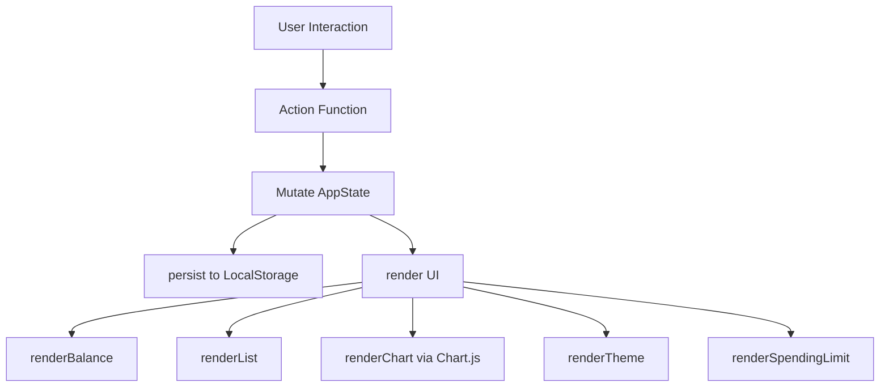

# Design Document: Expense & Budget Visualizer

## Overview

The Expense & Budget Visualizer is a single-page, client-side web application built exclusively with HTML, CSS, and Vanilla JavaScript. It allows users to record spending transactions, view a running total balance, browse a scrollable transaction history, and visualize spending distribution via a Chart.js pie chart. All data is persisted in the browser's Local Storage — no backend, no build tools, no framework required.

### Key Design Decisions

- **No framework**: All DOM manipulation is done with plain `document.querySelector` / `createElement` calls, keeping the bundle zero-dependency beyond Chart.js.
- **Single-file JS / CSS**: All application logic lives in `js/app.js`; all styling lives in `css/style.css`. This minimizes HTTP requests and avoids a build step.
- **Chart.js via CDN**: Loaded from the official Chart.js CDN (`https://cdn.jsdelivr.net/npm/chart.js`), giving access to the current v4 API without npm.
- **Mobile-first responsive layout**: Base styles target 320 px; a single media query at `min-width: 600px` switches to a two-column layout.
- **Event-driven state**: A single `AppState` object is the single source of truth. All UI components read from it and write back through thin action functions, which then call `render()` and `persist()`.

---

## Architecture

The application follows a **unidirectional data flow** pattern adapted for vanilla JS:

```
User Action → Action Function → Mutate AppState → persist() → render()
```

No direct DOM-to-DOM communication. Every UI update goes through `AppState`.

### Module Decomposition (within `js/app.js`)

```
js/app.js
├── Constants          — default categories, colour palette, storage keys
├── AppState           — single mutable state object
├── Storage            — loadState(), saveState(), loadCategories(), saveCategories(),
│                        loadTheme(), saveTheme(), loadSpendingLimit(), saveSpendingLimit()
├── Validation         — validateTransaction(), validateCategory(), validateSpendingLimit()
├── Actions            — addTransaction(), deleteTransaction(), addCategory(),
│                        setSort(), setTheme(), setSpendingLimit()
├── Chart              — initChart(), updateChart()
├── Render             — renderBalance(), renderList(), renderCategoryOptions(),
│                        renderChart(), renderTheme(), renderSpendingLimit()
└── Bootstrap          — init() — wires event listeners, loads state, initial render
```

### Data Flow Diagram



---

## Components and Interfaces

### 1. `AppState` Object

```js
const AppState = {
  transactions: [],   // Transaction[]
  categories: [],     // string[] — default + custom
  sortOrder: 'date-desc', // 'amount-asc' | 'amount-desc' | 'category-az'
  theme: 'light',     // 'light' | 'dark'
  spendingLimit: null // number | null
};
```

### 2. Transaction Input Form

**HTML structure**: `<form id="transaction-form">` containing:
- `<input type="text" id="item-name" maxlength="100">` — item name
- `<input type="number" id="item-amount" min="0.01" max="999999999.99" step="0.01">` — amount
- `<select id="category-select">` — populated from `AppState.categories`
- `<button type="submit">Add</button>`
- Inline error `<span>` elements adjacent to each field (`#name-error`, `#amount-error`)

**Custom category sub-form** (inside or below the main form):
- `<input type="text" id="custom-category" maxlength="50">`
- `<button type="button" id="add-category-btn">Add Category</button>`
- `<span id="category-error">` for inline validation feedback

**Interface**:
```js
validateTransaction(name, amount) → { valid: boolean, errors: { name?: string, amount?: string } }
addTransaction(name, amount, category) → void
```

### 3. Transaction List

**HTML structure**: `<section id="transaction-list">` with overflow-y: auto, max-height constrained.

Each transaction renders as:
```html
<article class="transaction-item" data-id="<uuid>">
  <span class="tx-name">...</span>
  <span class="tx-category">...</span>
  <span class="tx-amount">$X.XX</span>
  <button class="tx-delete" aria-label="Delete transaction">✕</button>
</article>
```

Empty state: `<p id="empty-state">No transactions recorded yet.</p>`

Sort control:
```html
<div id="sort-controls">
  <label for="sort-select">Sort by:</label>
  <select id="sort-select" disabled>
    <option value="date-desc">Date (newest first)</option>
    <option value="amount-asc">Amount (low to high)</option>
    <option value="amount-desc">Amount (high to low)</option>
    <option value="category-az">Category (A–Z)</option>
  </select>
</div>
```

**Interface**:
```js
deleteTransaction(id) → void
setSort(order) → void
getSortedTransactions() → Transaction[]
```

### 4. Balance Display

**HTML structure**:
```html
<header id="balance-header">
  <h1 id="balance-display" class="balance">$0.00</h1>
</header>
```

CSS classes toggled:
- `.balance--negative` → red colour
- `.balance--over-limit` → distinct highlight colour (e.g. orange/amber)

**Interface**:
```js
renderBalance() → void   // reads AppState, updates text + CSS classes
```

### 5. Pie Chart

**HTML structure**:
```html
<section id="chart-section">
  <canvas id="spending-chart"></canvas>
  <p id="chart-placeholder">Add transactions to see spending breakdown.</p>
</section>
```

**Chart.js initialisation** (v4 CDN):
```js
const chartInstance = new Chart(ctx, {
  type: 'pie',
  data: { labels: [], datasets: [{ data: [], backgroundColor: [] }] },
  options: {
    plugins: {
      legend: { display: true, position: 'bottom' },
      tooltip: { callbacks: { label: pctLabel } }
    },
    animation: { duration: 200 }
  }
});
```

**Update pattern** (live, no destroy/recreate):
```js
function updateChart(categoryTotals) {
  chartInstance.data.labels = Object.keys(categoryTotals);
  chartInstance.data.datasets[0].data = Object.values(categoryTotals);
  chartInstance.data.datasets[0].backgroundColor = assignColours(Object.keys(categoryTotals));
  chartInstance.update();
}
```

### 6. Spending Limit

**HTML structure**:
```html
<div id="spending-limit-panel">
  <label for="limit-input">Spending Limit:</label>
  <input type="number" id="limit-input" min="0.01" step="0.01">
  <button id="set-limit-btn">Set</button>
  <span id="limit-error"></span>
</div>
```

**Interface**:
```js
validateSpendingLimit(value) → { valid: boolean, error?: string }
setSpendingLimit(value) → void
```

### 7. Theme Toggle

**HTML structure**:
```html
<button id="theme-toggle" aria-label="Toggle dark mode">🌙</button>
```

- Applies `data-theme="dark"` attribute to `<html>` element.
- CSS custom properties switch via `[data-theme="dark"] { --bg: #1a1a2e; ... }`.

**Interface**:
```js
setTheme(theme) → void   // 'light' | 'dark'
```

---

## Data Models

### Transaction

```js
/**
 * @typedef {Object} Transaction
 * @property {string} id        — UUID v4 generated at creation time
 * @property {string} name      — Item name, 1–100 characters
 * @property {number} amount    — Positive number, 0.01–999,999,999.99
 * @property {string} category  — Category label (default or custom)
 * @property {number} createdAt — Unix timestamp (Date.now()) for tiebreaker sort
 */
```

### StorageSchema

```js
// Key: 'expense_transactions'
// Value: JSON.stringify(Transaction[])

// Key: 'expense_custom_categories'
// Value: JSON.stringify(string[])

// Key: 'expense_theme'
// Value: 'light' | 'dark'

// Key: 'expense_spending_limit'
// Value: JSON.stringify(number) | null
```

### Colour Palette

A fixed array of 12 distinct hex colours assigned to categories in insertion order:

```js
const COLOUR_PALETTE = [
  '#FF6384', '#36A2EB', '#FFCE56', '#4BC0C0',
  '#9966FF', '#FF9F40', '#C9CBCF', '#7CFC00',
  '#FF6347', '#1E90FF', '#DA70D6', '#20B2AA'
];
// Category colour = COLOUR_PALETTE[categoryIndex % COLOUR_PALETTE.length]
```

### Validation Rules

| Field            | Rule                                                                 |
|------------------|----------------------------------------------------------------------|
| `name`           | Non-empty string, 1–100 chars after trim                            |
| `amount`         | Parseable as float, in range [0.01, 999999999.99]                   |
| `category`       | Non-empty string, exists in `AppState.categories`                   |
| `customCategory` | Non-empty after trim, 1–50 chars, case-insensitive unique           |
| `spendingLimit`  | Parseable as float, in range [0.01, 999999999.99]                   |

---

## Correctness Properties

*A property is a characteristic or behavior that should hold true across all valid executions of a system — essentially, a formal statement about what the system should do. Properties serve as the bridge between human-readable specifications and machine-verifiable correctness guarantees.*

### Property 1: Transaction serialization round-trip

*For any* valid array of transactions, serializing it to a JSON string and then deserializing it SHALL produce a transaction list with strictly equal `name`, `amount`, `category`, and `id` fields for every item.

**Validates: Requirements 5.6**

---

### Property 2: Balance calculation correctness

*For any* non-empty list of transactions with valid positive amounts, the computed balance SHALL equal the exact arithmetic sum of all transaction amounts, and adding a new transaction SHALL increase the balance by exactly that transaction's amount.

**Validates: Requirements 3.2, 3.3**

---

### Property 3: Sort stability — amount ascending

*For any* list of transactions sorted by amount ascending, every adjacent pair `(txA, txB)` SHALL satisfy `txA.amount <= txB.amount`; when amounts are equal, `txA.createdAt >= txB.createdAt` (newer first as tiebreaker).

**Validates: Requirements 8.2, 8.5**

---

### Property 4: Sort stability — category A–Z

*For any* list of transactions sorted by category A–Z, every adjacent pair `(txA, txB)` SHALL satisfy `txA.category.localeCompare(txB.category) <= 0`; when categories are equal, `txA.createdAt >= txB.createdAt` (newer first as tiebreaker).

**Validates: Requirements 8.2, 8.5**

---

### Property 5: Custom category duplicate prevention

*For any* existing category list (case-insensitive), attempting to add a category whose normalized name already exists SHALL leave the category list unchanged and return a validation error.

**Validates: Requirements 7.4, 7.5**

---

### Property 6: Whitespace-only inputs are invalid

*For any* string composed entirely of whitespace characters (spaces, tabs, newlines), using it as a transaction item name, custom category name, or amount SHALL be rejected by validation and SHALL NOT modify `AppState`.

**Validates: Requirements 1.4, 7.5**

---

### Property 7: Spending limit highlight invariant

*For any* spending limit value `L > 0` and balance value `B`, the balance display SHALL carry the `.balance--over-limit` class if and only if `B > L`.

**Validates: Requirements 9.3, 9.4, 9.5**

---

### Property 8: Delete reduces balance and list

*For any* transaction list containing a transaction with id `i` and amount `a`, deleting transaction `i` SHALL reduce the list length by exactly 1 and SHALL reduce the balance by exactly `a`.

**Validates: Requirements 2.3, 3.3**

---

## Error Handling

| Scenario | Detection | User-Facing Response |
|---|---|---|
| Local Storage unavailable on write | `try/catch` around `localStorage.setItem` | Non-blocking toast/banner: "Could not save — changes are session-only." |
| Local Storage returns invalid JSON on read | `try/catch` around `JSON.parse`, check `Array.isArray` | Non-blocking banner: "Saved data could not be loaded. Starting fresh." |
| Local Storage unavailable on init | `try/catch` around `localStorage.getItem` | Silent fallback to empty state + system theme |
| Duplicate category | `validateCategory()` returns error | Inline error adjacent to category input |
| Empty / whitespace field | `validateTransaction()` / `validateCategory()` | Inline error adjacent to offending field |
| Amount out of range | `validateTransaction()` | Inline error on amount field |
| Spending limit out of range | `validateSpendingLimit()` | Inline error adjacent to limit input; previous value preserved |
| Chart canvas unavailable | `if (!ctx)` guard before `new Chart()` | Silent fallback; chart section hidden |

All non-blocking messages use a `<div id="toast-container">` that auto-dismisses after 4 seconds via `setTimeout`. This avoids `alert()` blocking the UI.

---

## Testing Strategy

### PBT Applicability Assessment

This feature is a client-side Vanilla JS app. The core logic — validation functions, sort comparators, balance calculation, serialization — consists of pure functions suitable for property-based testing. UI rendering and Local Storage interaction are better tested with example-based tests or integration tests.

### Unit Tests (example-based)

Focus on specific behaviors and edge cases:

- `validateTransaction()` with empty name, amount=0, amount=-1, amount above max
- `validateCategory()` with duplicate (same case, different case), whitespace
- `validateSpendingLimit()` with zero, negative, non-numeric
- `getSortedTransactions()` with a known fixture for each sort order
- `addTransaction()` then checking `AppState.transactions.length` increases
- `deleteTransaction()` then checking the id is absent from `AppState.transactions`
- Balance = 0 when no transactions
- Balance styled `.balance--negative` when (if) balance goes negative
- `renderBalance()` outputs correct currency format: `$1,234.56`

### Property-Based Tests

Using a PBT library such as [fast-check](https://fast-check.dev/) (loaded via CDN for browser-based tests, or run with Node + fast-check for pure-function tests):

Each property test runs a **minimum of 100 iterations**.

| Property | Test tag |
|---|---|
| Property 1: serialization round-trip | `Feature: expense-budget-visualizer, Property 1: Transaction serialization round-trip` |
| Property 2: balance calculation | `Feature: expense-budget-visualizer, Property 2: Balance calculation correctness` |
| Property 3: sort amount ascending | `Feature: expense-budget-visualizer, Property 3: Sort stability — amount ascending` |
| Property 4: sort category A–Z | `Feature: expense-budget-visualizer, Property 4: Sort stability — category A–Z` |
| Property 5: duplicate category prevention | `Feature: expense-budget-visualizer, Property 5: Custom category duplicate prevention` |
| Property 6: whitespace rejection | `Feature: expense-budget-visualizer, Property 6: Whitespace-only inputs are invalid` |
| Property 7: spending limit highlight invariant | `Feature: expense-budget-visualizer, Property 7: Spending limit highlight invariant` |
| Property 8: delete reduces balance and list | `Feature: expense-budget-visualizer, Property 8: Delete reduces balance and list` |

### Integration / Smoke Tests

- App loads without JS errors in Chrome, Firefox, Edge, Safari (manual cross-browser smoke test)
- Local Storage round-trip: add transaction → reload page → transaction still visible
- Theme toggle persisted: set dark → reload → dark theme restored
- Custom category persisted: add category → reload → category in selector
- Spending limit persisted: set limit → reload → limit restored and highlight state correct
- Chart renders on page load when transactions exist in Local Storage

### Accessibility Checks

- All form controls have associated `<label>` elements
- Interactive elements have minimum 44×44 px touch targets
- `aria-label` on icon-only buttons (delete, theme toggle)
- Sufficient colour contrast in both light and dark themes (WCAG 2.1 AA)
- Note: full accessibility validation requires manual testing with screen readers and expert review
